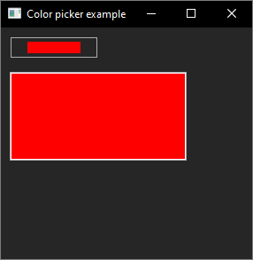
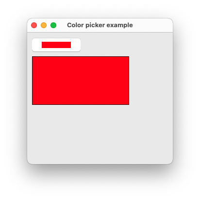
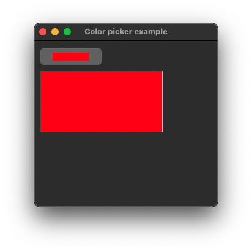
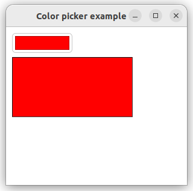
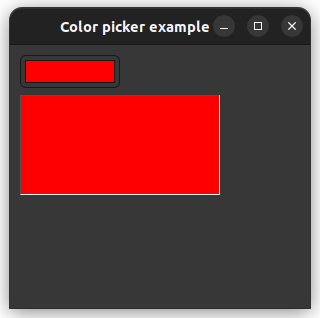

# color_picker

demonstrates the use of [xtd::forms::color_picker](../../../../src/xtd.forms/include/xtd/forms/color_picker.h) control.

# Sources

* [src/color_picker.cpp](src/color_picker.cpp)
* [CMakeLists.txt](CMakeLists.txt)

# Build and run

Open "Command Prompt" or "Terminal". Navigate to the folder that contains the project and type the following:

```shell
xtdc run
```

# Output

## Windows :




## macOS :





## Gnome :




