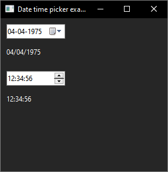
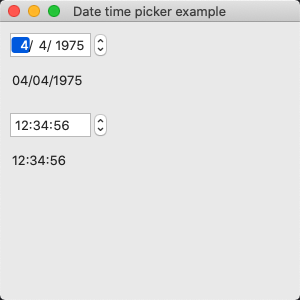
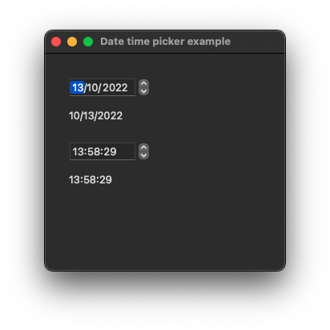
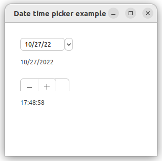
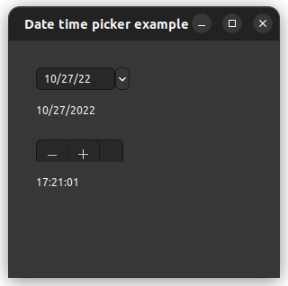

# date_time_picker

demonstrates the use of [xtd::forms::date_time_picker](https://gammasoft71.github.io/xtd/reference_guides/latest/classxtd_1_1forms_1_1date__time__picker.html) dialog.

## Sources

* [src/date_time_picker.cpp](src/date_time_picker.cpp)
* [CMakeLists.txt](CMakeLists.txt)

## Build and run

Open "Command Prompt" or "Terminal". Navigate to the folder that contains the project and type the following:

```shell
xtdc run
```

## Output

## Windows :




## macOS :





## Gnome :




