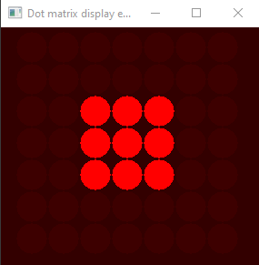
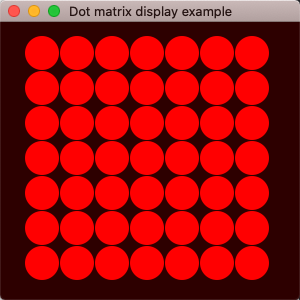

# dot_matrix_display

demonstrates how to use [xtd::forms::dot_matrix_display](../../../../src/xtd.forms/include/xtd/forms/dot_matrix_display.h) control.

# Sources

* [src/dot_matrix_display.cpp](src/dot_matrix_display.cpp)
* [CMakeLists.txt](CMakeLists.txt)

# Build and run

Open "Command Prompt" or "Terminal". Navigate to the folder that contains the project and type the following:

```shell
xtdc run
```

# Output

## Windows :




## macOS :




## Gnome :


