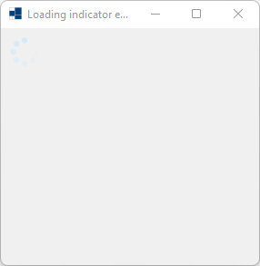
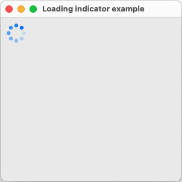
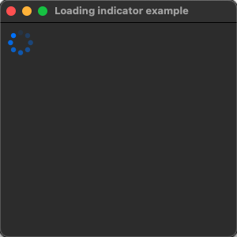
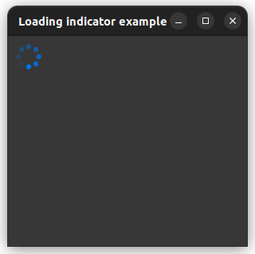

# loading_indicator

represents a Windows control to display a loading indicator animation.

# Sources

[src/loading_indicator.cpp](src/loading_indicator.cpp)

[CMakeLists.txt](CMakeLists.txt)

# Build and run

Open "Command Prompt" or "Terminal". Navigate to the folder that contains the project and type the following:

```shell
xtdc run
```

# Output

## Windows :




## macOS :





## Gnome :



