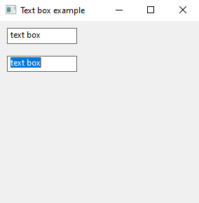
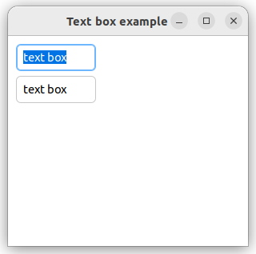
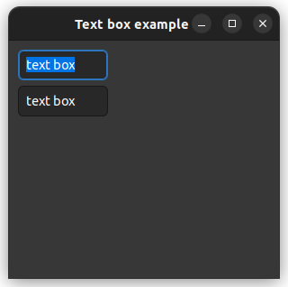

# text_box

demonstrates the use of [xtd::forms::text_box](../../../../src/xtd.forms/include/xtd/forms/text_box.h) control.

# Sources

* [src/text_box.cpp](src/text_box.cpp)
* [CMakeLists.txt](CMakeLists.txt)

# Build and run

Open "Command Prompt" or "Terminal". Navigate to the folder that contains the project and type the following:

```shell
xtdc run
```

# Output

## Windows :




## macOS :


## Gnome :




