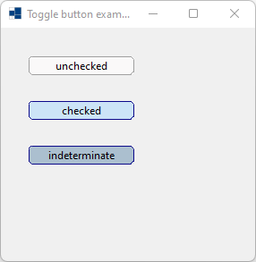
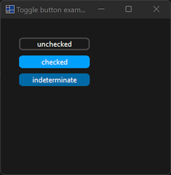
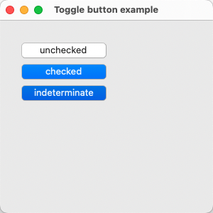
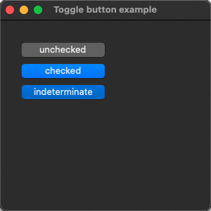
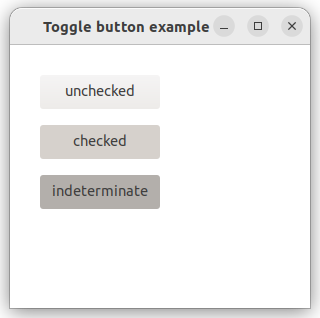

# toggle_button

demonstrates the use of [xtd::forms::toggle_button](../../../../src/xtd.forms/include/xtd/forms/toggle_button.h) control.

# Sources

* [src/toggle_button.cpp](src/toggle_button.cpp)
* [CMakeLists.txt](CMakeLists.txt)

# Build and run

Open "Command Prompt" or "Terminal". Navigate to the folder that contains the project and type the following:

```shell
xtdc run
```

# Output

## Windows :





## macOS :





## Gnome :




