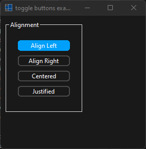
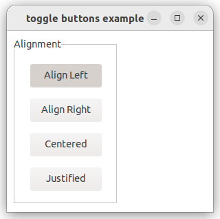
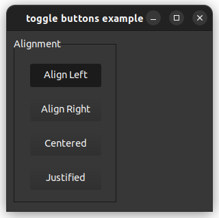

# toggle_buttons

demonstrates the use of [xtd::forms::toggle_buttons](https://gammasoft71.github.io/xtd/reference_guides/latest/classxtd_1_1forms_1_1toggle__buttons.html) toggle_button object collection.

## Sources

* [src/toggle_buttons.cpp](src/toggle_buttons.cpp)
* [CMakeLists.txt](CMakeLists.txt)

## Build and run

Open "Command Prompt" or "Terminal". Navigate to the folder that contains the project and type the following:

```shell
xtdc run
```

## Output

## Windows :




## macOS :


## Gnome :




