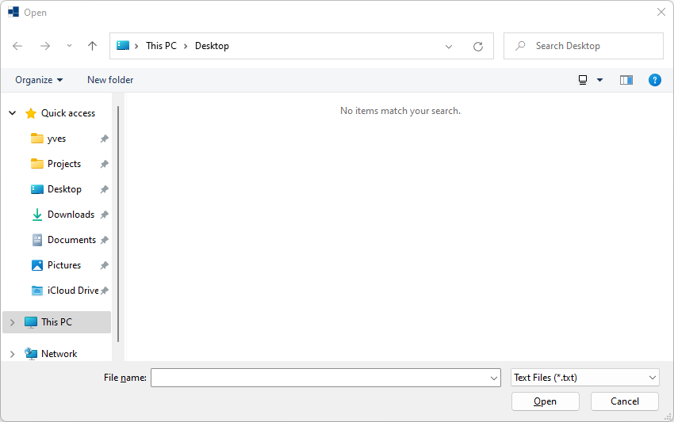

# open_file_box

demonstrates the use of [xtd::forms::open_file_box](../../../../src/xtd.forms/include/xtd/forms/open_file_box.h) file dialog.

# Sources

* [src/open_file_box.cpp](src/open_file_box.cpp)
* [CMakeLists.txt](CMakeLists.txt)

# Build and run

Open "Command Prompt" or "Terminal". Navigate to the folder that contains the project and type the following:

```shell
xtdc run
```

# Output

## Windows :
TODO
<!-- 


 -->
 
## macOS :
TODO

## Gnome :
TODO