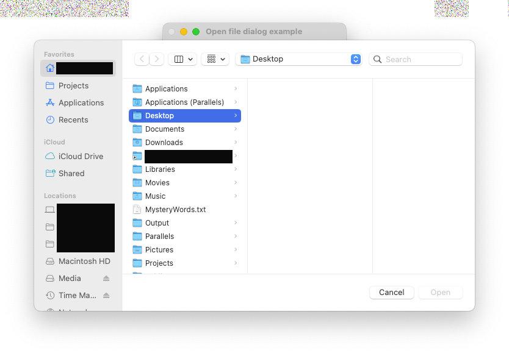
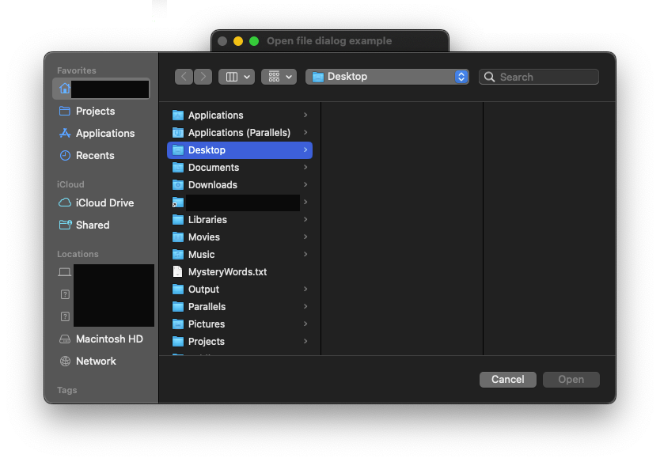
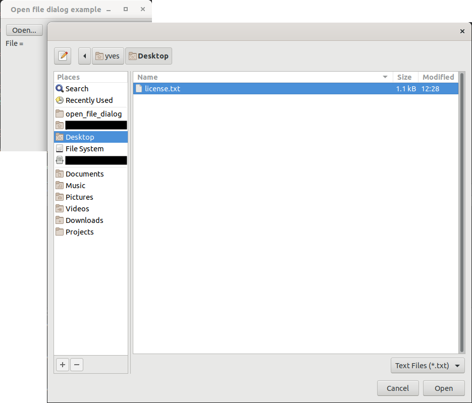
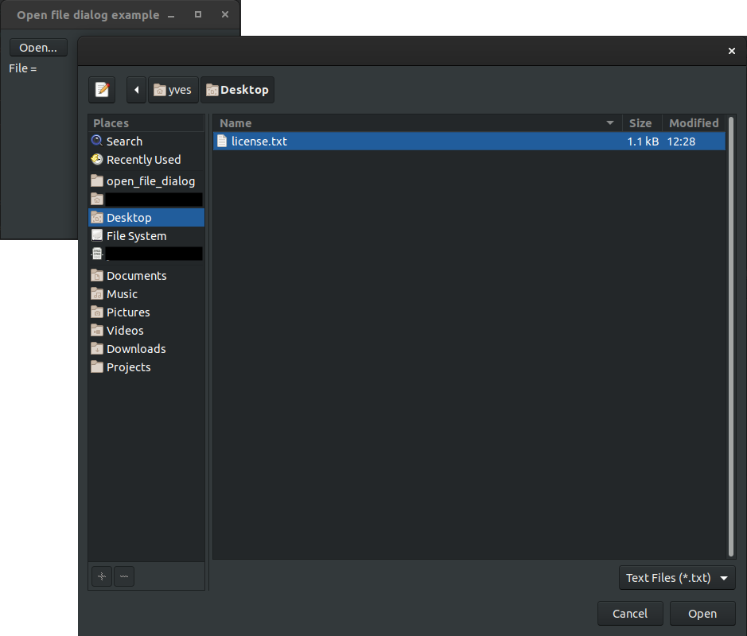

# open_file_dialog

demonstrates the use of [xtd::forms::open_file_dialog](https://gammasoft71.github.io/xtd/reference_guides/latest/classxtd_1_1forms_1_1open__file__dialog.html) dialog.

## Sources

* [src/open_file_dialog.cpp](src/open_file_dialog.cpp)
* [CMakeLists.txt](CMakeLists.txt)

## Build and run

Open "Command Prompt" or "Terminal". Navigate to the folder that contains the project and type the following:

```shell
xtdc run
```

## Output

### Windows :


### macOS :





### Gnome :




