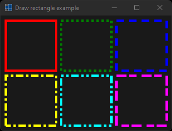
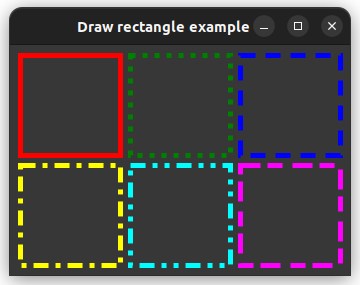

# draw_rectangle

shows how to draw rectangle in paint event using [xtd::drawing::graphics::draw_rectangle](https://gammasoft71.github.io/xtd/reference_guides/latest/classxtd_1_1drawing_1_1graphics.html#a25edc7b5e0d49ab6398459e9291e340f).

## Sources

* [src/draw_rectangle.cpp](src/draw_rectangle.cpp)
* [CMakeLists.txt](CMakeLists.txt)

## Build and run

Open "Command Prompt" or "Terminal". Navigate to the folder that contains the project and type the following:

```shell
xtdc run
```

## Output

### Windows :




### macOS :


### Gnome :



