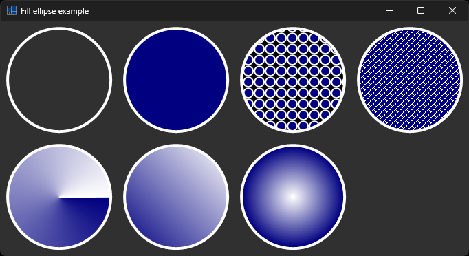

# fill_ellipse

shows how to fill elipse in paint event.

# Sources

* [src/fill_ellipse.cpp](src/fill_ellipse.cpp)
* [CMakeLists.txt](CMakeLists.txt)

# Build and run

Open "Command Prompt" or "Terminal". Navigate to the folder that contains the project and type the following:

```shell
xtdc run
```

# Output

## Windows :




## macOS :


## Gnome :


