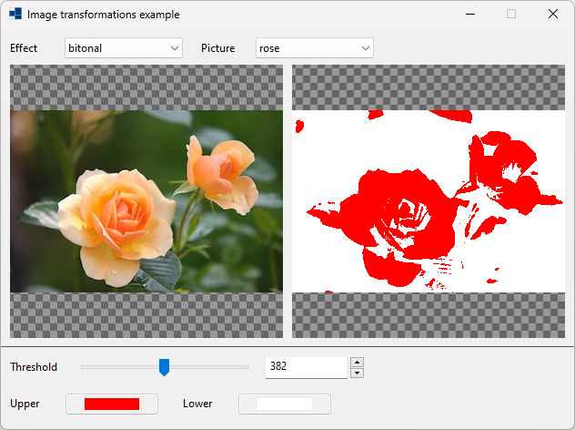
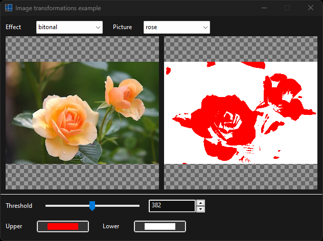
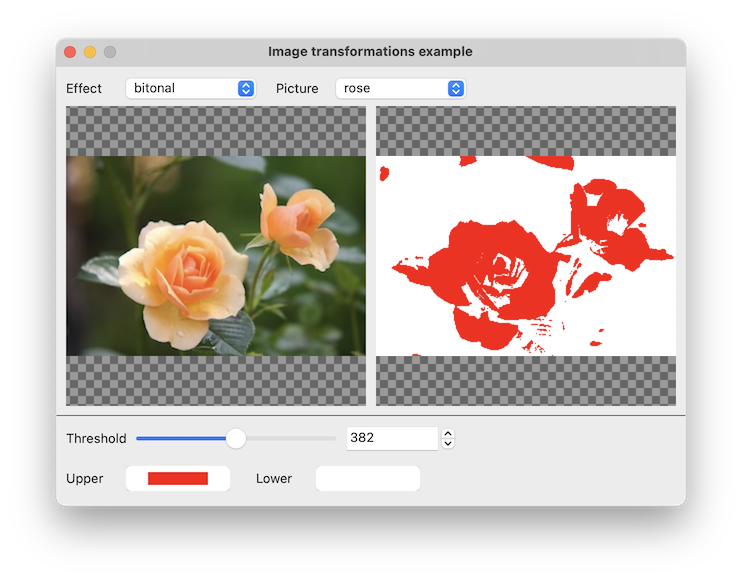
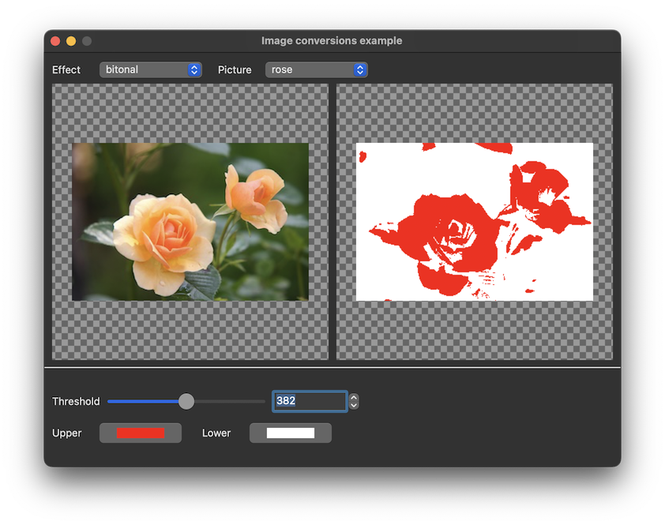
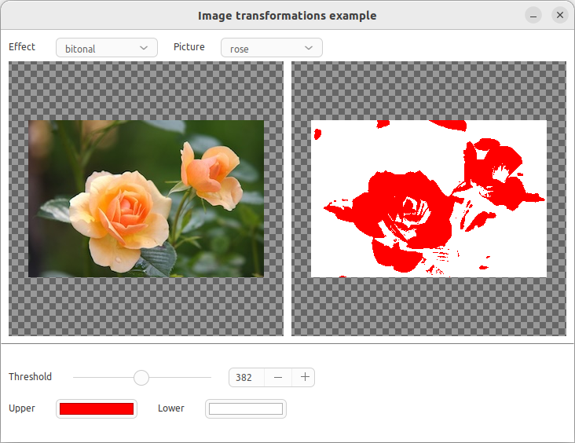
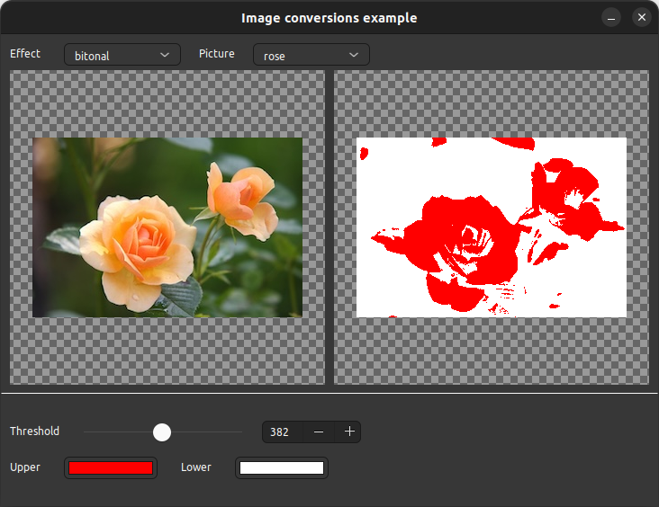

# image_converter

shows how to use [xtd::drawing::graphics::image_converter](https://gammasoft71.github.io/xtd/reference_guides/latest/classxtd_1_1drawing_1_1image__converter.html) class.

## Sources

* [properties/resources.cmake](properties/resources.cmake)
* [resources/ball.png](resources/ball.png)
* [resources/pineapple.jpg](resources/pineapple.jpg)
* [resources/rose.jpg](resources/rose.jpg)
* [src/image_converter.cpp](src/image_converter.cpp)
* [CMakeLists.txt](CMakeLists.txt)

## Build and run

Open "Command Prompt" or "Terminal". Navigate to the folder that contains the project and type the following:

```shell
xtdc run
```

## Output

### Windows :





### macOS :





### Gnome :




