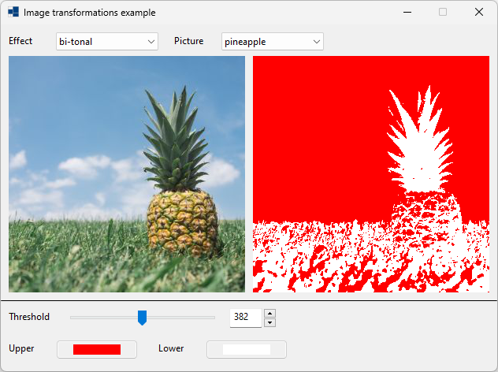
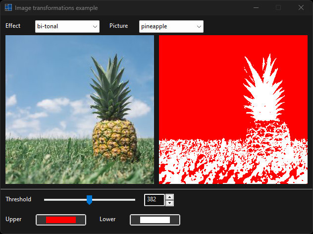
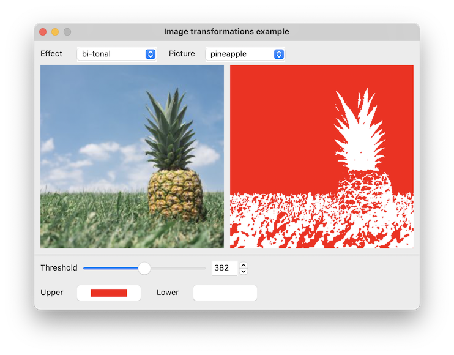

# image_transformer

shows how to use [xtd::drawing::graphics::image_transformer](https://gammasoft71.github.io/xtd/reference_guides/latest/classxtd_1_1drawing_1_1image_1_1transformer.html) class.

## Sources

* [src/image_transformer.cpp](src/image_transformer.cpp)
* [CMakeLists.txt](CMakeLists.txt)

## Build and run

Open "Command Prompt" or "Terminal". Navigate to the folder that contains the project and type the following:

```shell
xtdc run
```

## Output

### Windows :





### macOS :




### Gnome :


