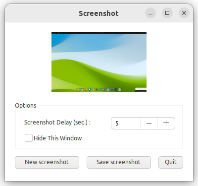
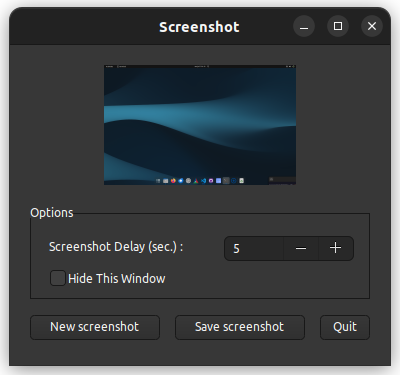

# screenshot

shows how to fill ellipse in paint event using [xtd::drawing::graphics::copy_from_screen](https://gammasoft71.github.io/xtd/reference_guides/latest/classxtd_1_1drawing_1_1graphics.html#adb069509105190a2d1d0f8a04db2d7db).

## Sources

* [src/screenshot.cpp](src/screenshot.cpp)
* [CMakeLists.txt](CMakeLists.txt)

## Build and run

Open "Command Prompt" or "Terminal". Navigate to the folder that contains the project and type the following:

```shell
xtdc run
```

## Output

### Windows :


### macOS :


### Gnome :




