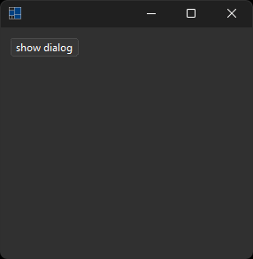
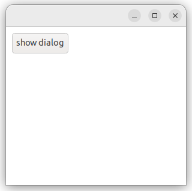
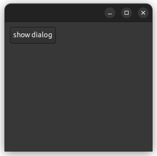

# application_events

demonstrates the use of [application](../../../../src/xtd.forms/include/xtd/forms/application.h) events.

# Sources

* [src/application_events.cpp](src/application_events.cpp)
* [CMakeLists.txt](CMakeLists.txt)

# Build and run

Open "Command Prompt" or "Terminal". Navigate to the folder that contains the project and type the following:

```shell
xtdc run
```

# Output

## Windows :




## macOS :


## Gnome :




