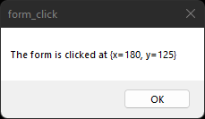

# form_click

demonstrates the use of [form](https://gammasoft71.github.io/xtd/reference_guides/latest/group__events.html#gafbf4f123f0b8b904992f3476a1b12b3d) event.

## Sources

* [src/form_click.cpp](src/form_click.cpp)
* [CMakeLists.txt](CMakeLists.txt)

## Build and run

Open "Command Prompt" or "Terminal". Navigate to the folder that contains the project and type the following:

```shell
xtdc run
```

## Output

### Windows :




### macOS :


### Gnome :


