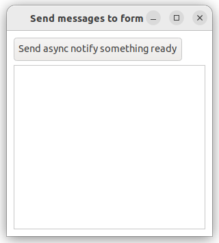
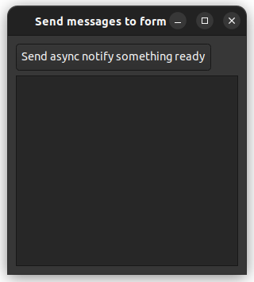

# send_message_to_form

demonstrates some events received by [form](https://gammasoft71.github.io/xtd/reference_guides/latest/classxtd_1_1forms_1_1form.html).

## Sources

* [src/send_message_to_form.cpp](src/send_message_to_form.cpp)
* [CMakeLists.txt](CMakeLists.txt)

## Build and run

Open "Command Prompt" or "Terminal". Navigate to the folder that contains the project and type the following:

```shell
xtdc run
```

## Output

## Windows :


## macOS :


## Gnome :




