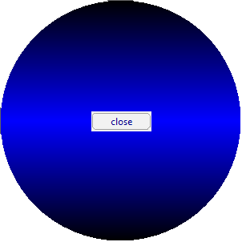
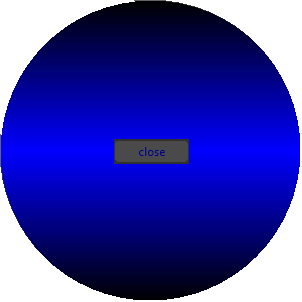
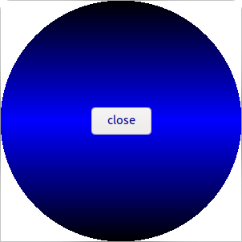

# circular_form

demonstrates the use of [xtd::forms::control::region](../../../../src/xtd.forms/include/xtd/forms/control.h) property for create a circular form.

# Sources

* [src/circular_form.cpp](src/circular_form.cpp)
* [CMakeLists.txt](CMakeLists.txt)

# Build and run

Open "Command Prompt" or "Terminal". Navigate to the folder that contains the project and type the following:

```shell
xtdc run
```

# Output

## Windows :





## macOS :


## Gnome :




