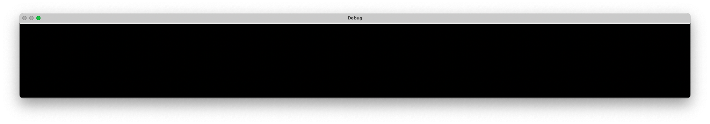
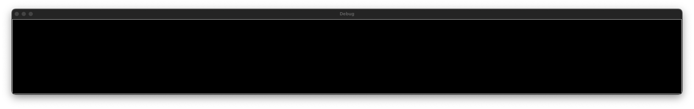

# debug_form

demonstrates the use of [xtd::debug_forms::debug_form](../../../../src/xtd.forms/include/xtd/forms/debug_form.h) container.

# Sources

* [src/debug_form.cpp](src/debug_form.cpp)
* [CMakeLists.txt](CMakeLists.txt)

# Build and run

Open "Command Prompt" or "Terminal". Navigate to the folder that contains the project and type the following:

```shell
xtdc run
```

# Output

## Windows :


## macOS :





## Gnome :


