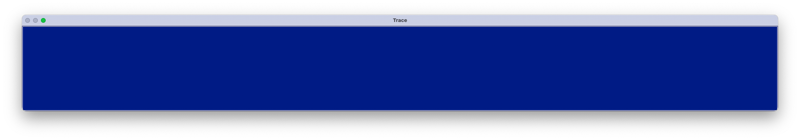

# trace_form

demonstrates the use of [xtd::trace_forms::trace_form](../../../../src/xtd.forms/include/xtd/forms/trace_form.h) container.

# Sources

* [src/trace_form.cpp](src/trace_form.cpp)
* [CMakeLists.txt](CMakeLists.txt)

# Build and run

Open "Command Prompt" or "Terminal". Navigate to the folder that contains the project and type the following:

```shell
xtdc run
```

# Output

## Windows :


## macOS :




## Gnome :


