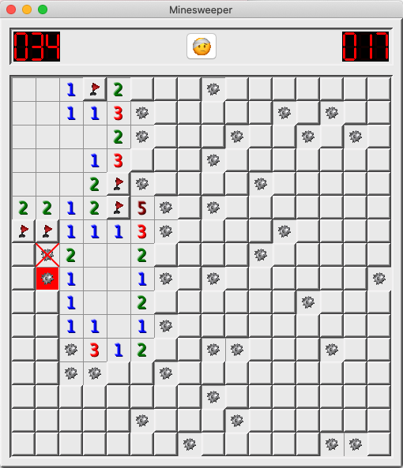
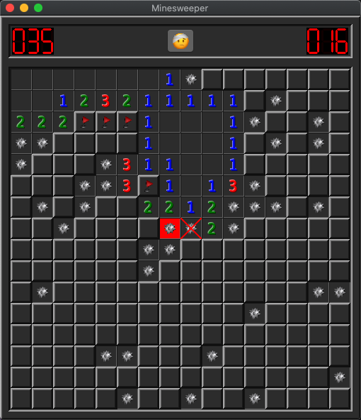
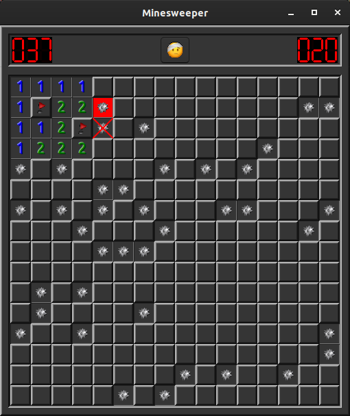

# minesweeper

The goal of the game is to uncover all the squares that do not contain mines.

To mark a mine use right click. Minesweeper is one of the most interesting logic games.

The objective of the game is to clear a rectangular board containing hidden "mines" or landmine without detonating any of them, 
with help from clues about the number of neighboring landmine in each field.

Minesweeper features:
 - Variable minefield.
 - Very addictive puzzle.
 - Its a real classic minesweeper free.
 - Adapted to the screen.
 
 If you like minesweeper, you're going to love this game!
 
 See [help](docs/help.md) for more information.
 
# Sources

* [src/cell.h](src/cell.h)
* [src/cell.cpp](src/cell.cpp)
* [src/cell_state.h](src/cell_state.h)
* [src/high_scores_dialog.h](src/high_scores_dialog.h)
* [src/high_scores_dialog.cpp](src/high_scores_dialog.cpp)
* [src/input_name_dialog.h](src/input_name_dialog.h)
* [src/input_name_dialog.cpp](src/input_name_dialog.cpp)
* [src/level.h](src/level.h)
* [src/minesweeper.h](src/minesweeper.h)
* [src/minesweeper.cpp](src/minesweeper.cpp)

# Properties

* [properties/resources.cmake](properties/resources.cmake)
* [properties/settings.cmake](properties/settings.cmake)
* [properties/target_properties.cmake](properties/target_properties.cmake)

# Resources

* [resources/bomb.mp3](resources/bomb.mp3)
* [resources/flag.png](resources/flag.png)
* [resources/help.md](resources/help.md)
* [resources/mine.png](resources/mine.png)
* [resources/minesweeper.icns](resources/minesweeper.icns)
* [resources/minesweeper.ico](resources/minesweeper.ico)
* [resources/minesweeper.png](resources/minesweeper.png)
* [resources/smiley1.png](resources/smiley1.png)
* [resources/smiley2.png](resources/smiley2.png)
* [resources/smiley3.png](resources/smiley3.png)
* [resources/smiley4.png](resources/smiley4.png)

# CMake files

* [CMakeLists.txt](CMakeLists.txt)

# Build and run

Open "Command Prompt" or "Terminal". Navigate to the folder that contains the project and type the following:

```shell
xtdc run
```

# Output

## Windows :


## macOS :





## Gnome :



