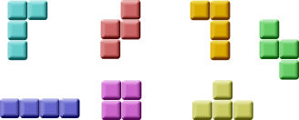

# tetris

The Tetris game is one of the most popular computer games ever created. 
The original game was designed and programmed by a Russian programmer Alexey Pajitnov in 1985. 
Since then, Tetris is available on almost every computer platform in lots of variations.

Tetris is called a falling block puzzle game. 
In this game, we have seven different shapes called tetrominoes. 
S-shape, Z-shape, T-shape, L-shape, Line-shape, MirroredL-shape, and a Square-shape. 
Each of these shapes is formed with four squares. The shapes are falling down the board. 
The object of the Tetris game is to move and rotate the shapes, so that they fit as much as possible. 
If we manage to form a row, the row is destroyed and we score. 
We play the Tetris game until we top out.



## Sources

* [src/board_control.cpp](src/board_control.cpp)
* [src/board_control.hpp](src/board_control.hpp)
* [src/shape.cpp](src/shape.cpp)
* [src/shape.hpp](src/shape.hpp)
* [src/tetris_form.cpp](src/tetris_form.cpp)
* [src/tetris_form.hpp](src/tetris_form.hpp)
* [src/tetrominoes.hpp](src/tetrominoes.hpp)
* [CMakeLists.txt](CMakeLists.txt)

## Build and run

Open "Command Prompt" or "Terminal". Navigate to the folder that contains the project and type the following:

```shell
xtdc run
```

## Output

### Windows :


### macOS :


### Gnome :


