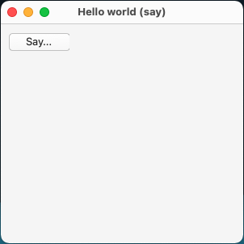
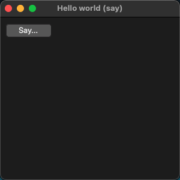
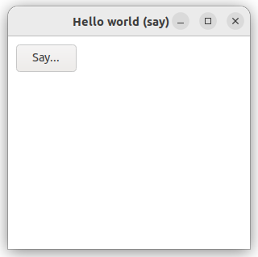
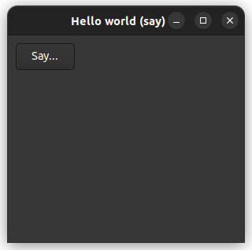

# hello_world_say

The classic first application "Hello, World!" with [xtd::forms::button](../../../../src/xtd.forms/include/xtd/forms/button.h) control.

# Sources

* [src/hello_world_say.cpp](src/hello_world_say.cpp)
* [CMakeLists.txt](CMakeLists.txt)

# Build and run

Open "Command Prompt" or "Terminal". Navigate to the folder that contains the project and type the following:

```shell
xtdc run
```

# Output

## Windows :


## macOS :





## Linux Gnome :




