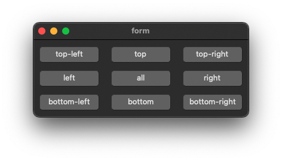

# anchors

demonstrates the use of [xtd::forms::control::button](https://gammasoft71.github.io/xtd/reference_guides/latest/classxtd_1_1forms_1_1button.html) control with [xtd::forms::control::anchor](https://gammasoft71.github.io/xtd/reference_guides/latest/classxtd_1_1forms_1_1tool__bar.html).

## Sources

* [src/anchors.cpp](src/anchors.cpp)
* [CMakeLists.txt](CMakeLists.txt)

## Build and run

Open "Command Prompt" or "Terminal". Navigate to the folder that contains the project and type the following:

```shell
xtdc run
```

## Output

### Windows :


### macOS :




### Gnome :


