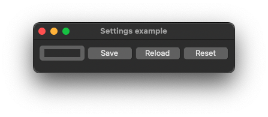

# application_settings2

demonstrates the use of [xtd::settings](https://gammasoft71.github.io/xtd/reference_guides/latest/classxtd_1_1settings.html) component.

## Sources

* [src/application_settings2.cpp](src/application_settings2.cpp)
* [CMakeLists.txt](CMakeLists.txt)

## Build and run

Open "Command Prompt" or "Terminal". Navigate to the folder that contains the project and type the following:

```shell
xtdc run
```

## Output

### Windows :


### macOS :




### Gnome :


