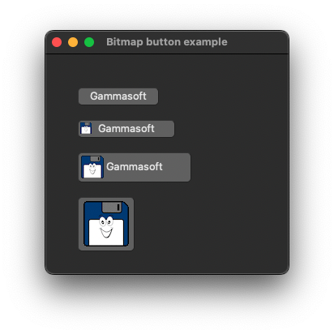

# bitmap_button_with_text

demonstrates the use of [xtd::forms::button](https://gammasoft71.github.io/xtd/reference_guides/latest/classxtd_1_1forms_1_1button.html) control with image.

## Sources

* [src/bitmap_button_with_text.cpp](src/bitmap_button_with_text.cpp)
* [resources/gammasoft_16x16.xpm](resources/gammasoft_16x16.xpm)
* [resources/gammasoft_32x32.xpm](resources/gammasoft_32x32.xpm)
* [resources/gammasoft_64x64.xpm](resources/gammasoft_64x64.xpm)
* [CMakeLists.txt](CMakeLists.txt)

## Build and run

Open "Command Prompt" or "Terminal". Navigate to the folder that contains the project and type the following:

```shell
xtdc run
```

## Output

### Windows :


### macOS :




### Gnome :


