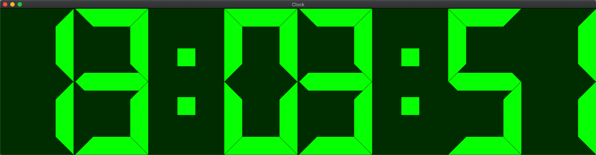

# clock

demonstrates the use of [xtd::forms::lcd_label](https://gammasoft71.github.io/xtd/reference_guides/latest/classxtd_1_1forms_1_1lcd__label.html) control.

## Sources

* [src/clock.cpp](src/clock.cpp)
* [CMakeLists.txt](CMakeLists.txt)

## Build and run

Open "Command Prompt" or "Terminal". Navigate to the folder that contains the project and type the following:

```shell
xtdc run
```

## Output

## Windows :


## macOS :




## Gnome :


