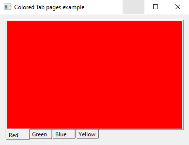
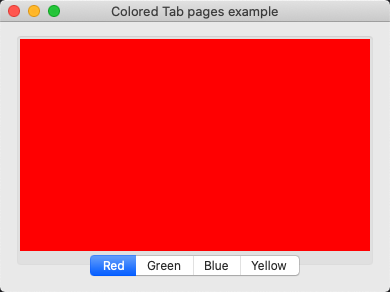
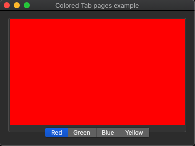

# colored_tab_pages

demonstrates the use of [xtd::forms::tab_page](../../../../src/xtd.forms/include/xtd/forms/tab_page.h) control with unicode text.

# Sources

* [src/colored_tab_pages.cpp](src/colored_tab_pages.cpp)
* [CMakeLists.txt](CMakeLists.txt)

# Build and run

Open "Command Prompt" or "Terminal". Navigate to the folder that contains the project and type the following:

```shell
xtdc run
```

# Output

## Windows :




## macOS :





## Gnome :


