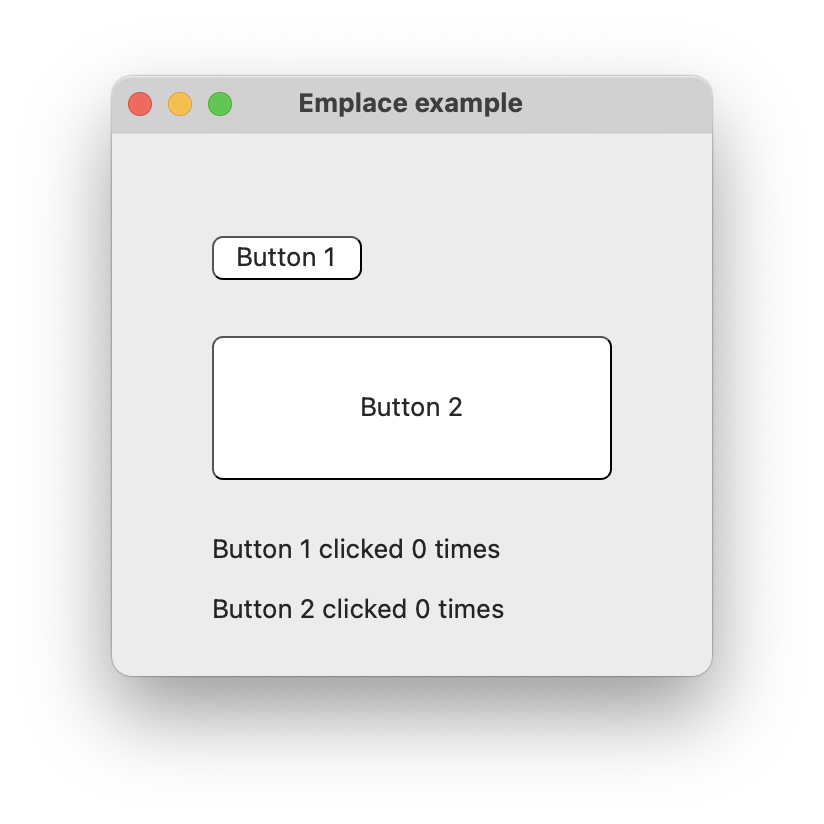
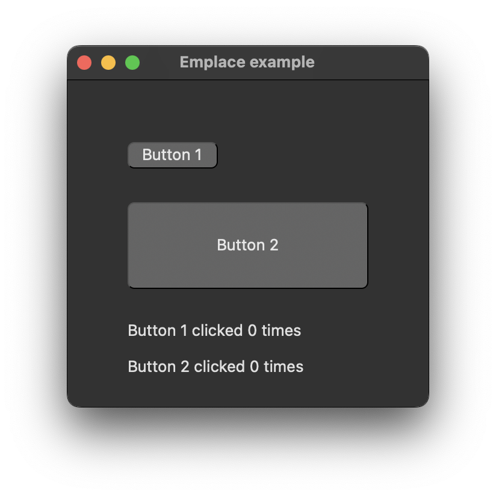

# emplace

demonstrates the use of [xtd::forms::control::control_collection::emplace](https://gammasoft71.github.io/xtd/reference_guides/latest/classxtd_1_1forms_1_1control_1_1control__collection.html), [xtd::forms::control::control_collection::emplace_at](https://gammasoft71.github.io/xtd/reference_guides/latest/classxtd_1_1forms_1_1control_1_1control__collection.html), [xtd::forms::control::control_collection::emplace_back](https://gammasoft71.github.io/xtd/reference_guides/latest/classxtd_1_1forms_1_1control_1_1control__collection.html) methods.

## Sources

* [src/emplace.cpp](src/emplace.cpp)
* [CMakeLists.txt](CMakeLists.txt)

## Build and run

Open "Command Prompt" or "Terminal". Navigate to the folder that contains the project and type the following:

```shell
xtdc run
```

## Output

### Windows :


### macOS :





### Gnome :


