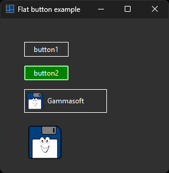
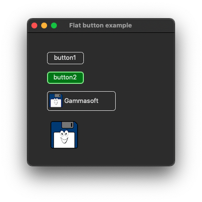
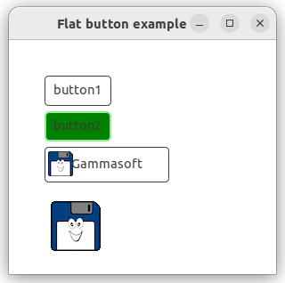
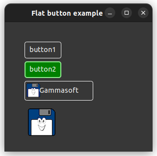

# flat_button

demonstrates the use of [xtd::forms::button](../../../../src/xtd.forms/include/xtd/forms/button.h) control with flat style.

# Sources

* [src/flat_button.cpp](src/flat_button.cpp)
* [reources/gammasoft_32x32.xpm](reources/gammasoft_32x32.xpm)
* [reources/gammasoft_64x64.xpm](reources/gammasoft_64x64.xpm)
* [CMakeLists.txt](CMakeLists.txt)

# Build and run

Open "Command Prompt" or "Terminal". Navigate to the folder that contains the project and type the following:

```shell
xtdc run
```

# Output

## Windows :




## macOS :




## Gnome :




