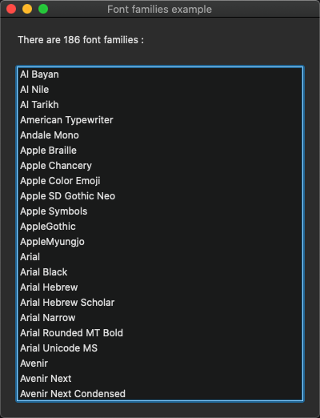
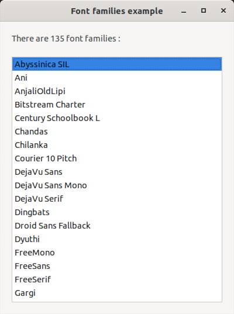
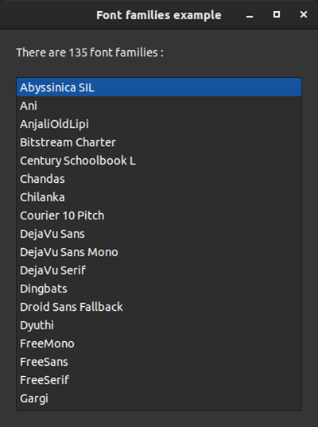

# font_families

demonstrates the use of [xtd::drawing::font_families](https://gammasoft71.github.io/xtd/reference_guides/latest/classxtd_1_1drawing_1_1font__family.html#a9ad7cafdc9e9966d8222c7dcedeab43a) method, which returns an array of [xtd::drawing::font_family](https://gammasoft71.github.io/xtd/reference_guides/latest/classxtd_1_1drawing_1_1font__family.html) objects associated with the current graphics context.

## Sources

* [src/font_families.cpp](src/font_families.cpp)
* [CMakeLists.txt](CMakeLists.txt)

## Build and run

Open "Command Prompt" or "Terminal". Navigate to the folder that contains the project and type the following:

```shell
xtdc run
```

## Output

### Windows :


### macOS :




### Gnome :




