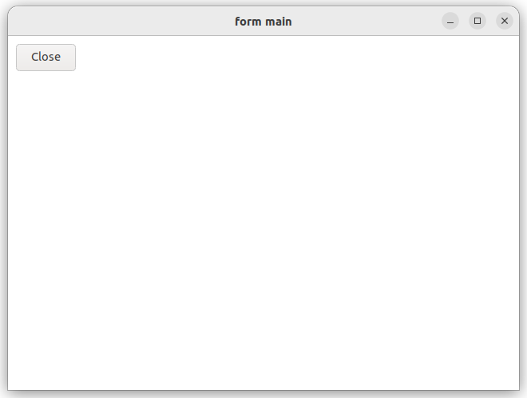
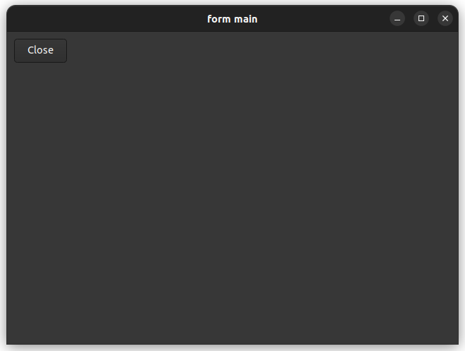

# form_and_main

demonstrates how to use [startup_](https://gammasoft71.github.io/xtd/reference_guides/latest/group__keywords.html#gac9b8e6f22fb2fdc1bb915ee01aef848c) keyword.

## Sources

* [src/form_and_main.cpp](src/form_and_main.cpp)
* [CMakeLists.txt](CMakeLists.txt)

## Build and run

Open "Command Prompt" or "Terminal". Navigate to the folder that contains the project and type the following:

```shell
xtdc run
```

## Output

### Windows :


### macOS :


### Gnome :




