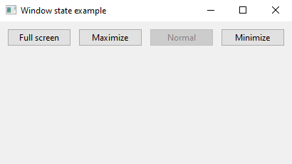
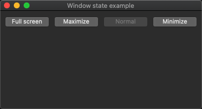
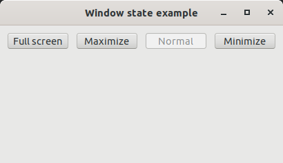
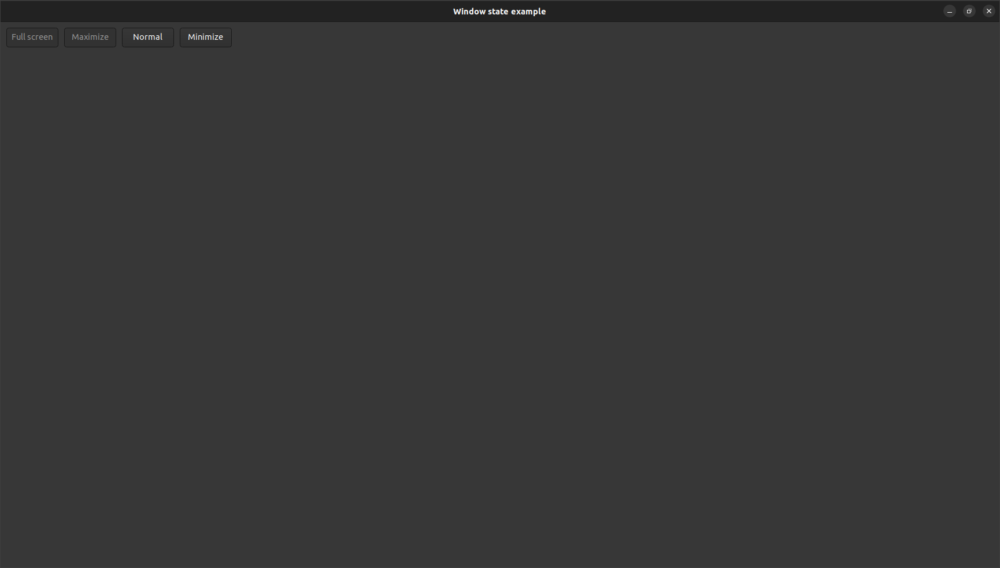

# form_window_state

demonstrates the use of [xtd::forms::form](../../../../src/xtd.forms/include/xtd/forms/form.h) window state.

# Sources

* [src/form_window_state.cpp](src/form_window_state.cpp)
* [CMakeLists.txt](CMakeLists.txt)

# Build and run

Open "Command Prompt" or "Terminal". Navigate to the folder that contains the project and type the following:

```shell
xtdc run
```

# Output

## Windows :



## macOS :




## Gnome :




