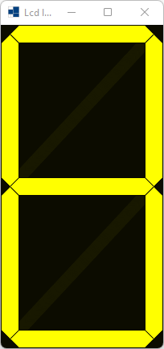

# lcd_label_with_nine_segment

demonstrates how to use [xtd::forms::lcd_label_with_nine_segment](https://gammasoft71.github.io/xtd/reference_guides/latest/classxtd_1_1forms_1_1nine__segment__display.html) control.

## Sources

[src/lcd_label_with_nine_segment.cpp](src/lcd_label_with_nine_segment.cpp)

[CMakeLists.txt](CMakeLists.txt)

## Build and run

Open "Command Prompt" or "Terminal". Navigate to the folder that contains the project and type the following:

```shell
xtdc run
```

## Output

## Windows :




## macOS :


## Gnome :


