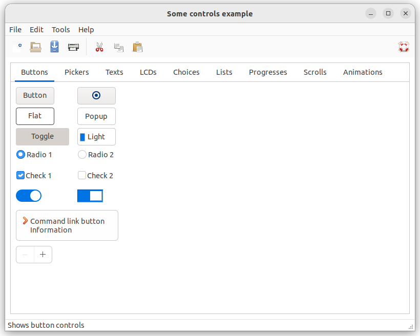

# some_controls

This example demonstrates the use of some controls.

# Sources

* [src/some_controls.cpp](src/some_controls.cpp)
* [CMakeLists.txt](CMakeLists.txt)

# Build and run

Open "Command Prompt" or "Terminal". Navigate to the folder that contains the project and type the following:

```shell
xtdc run
```

# Output

## Windows :


## macOS :


## Gnome :




