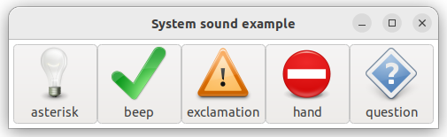

# system_sound

This example demonstrates the use of [xtd::media::system_sound](https://gammasoft71.github.io/xtd/reference_guides/latest/classxtd_1_1media_1_1system__sound.html) component.

## Sources

* [src/system_sound.cpp](src/system_sound.cpp)
* [CMakeLists.txt](CMakeLists.txt)

## Build and run

Open "Command Prompt" or "Terminal". Navigate to the folder that contains the project and type the following:

```shell
xtdc run
```

## Output

## Windows :


## macOS :


## Gnome :




