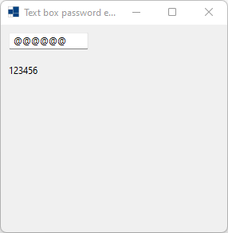
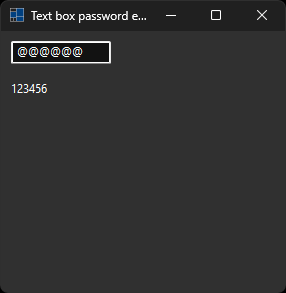
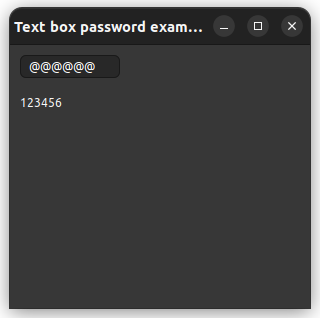

# text_box_password2

demonstrates the use of [xtd::forms::text_box_password](https://gammasoft71.github.io/xtd/reference_guides/latest/classxtd_1_1forms_1_1text__box.html#aae0d3ea61c5f5e178d7e8b55b9832139) control.

## Sources

* [src/text_box_password.cpp](src/text_box_password.cpp)
* [CMakeLists.txt](CMakeLists.txt)

## Build and run

Open "Command Prompt" or "Terminal". Navigate to the folder that contains the project and type the following:

```shell
xtdc run
```

## Output

### Windows :





### macOS :


### Gnome :



