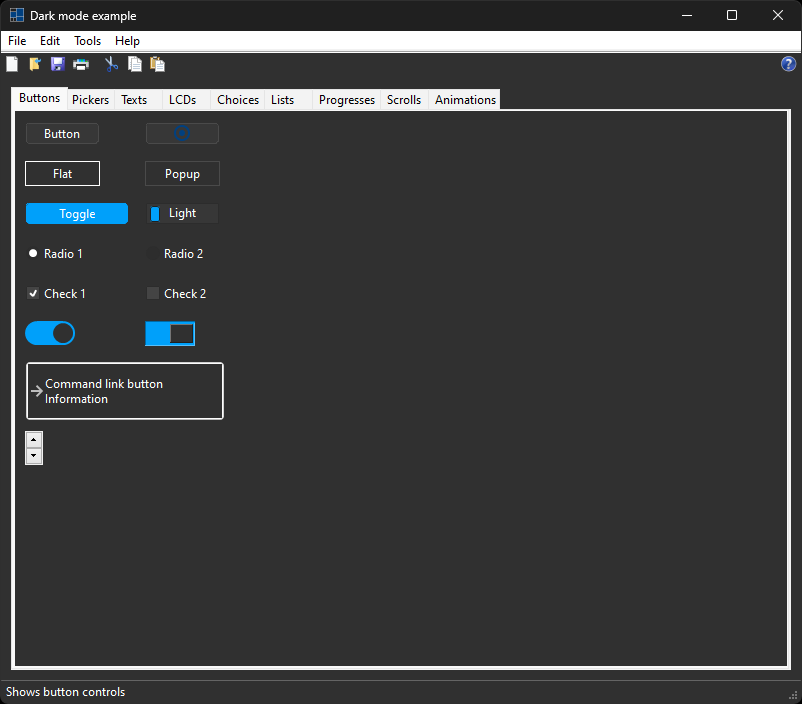

# application_enable_dark_mode

Shows how to create an application with  [xtd::forms::application::enable_dark_mode](../../../../src/xtd.forms/include/xtd/forms/application.h) method.

# Sources

* [src/application_enable_dark_mode.cpp](src/application_enable_dark_mode.cpp)
* [CMakeLists.txt](CMakeLists.txt)

# Build and run

Open "Command Prompt" or "Terminal". Navigate to the folder that contains the project and type the following:

```shell
xtdc run
```

# Output

## Windows :



## macOS :


## Gnome :


