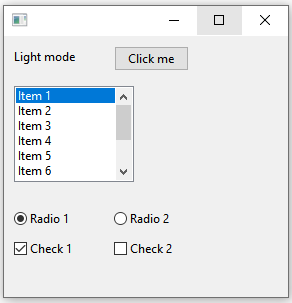
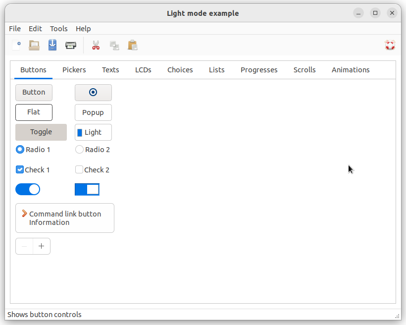

# application_enable_light_mode

Shows how to create an application with  [xtd::forms::application::enable_light_mode](https://gammasoft71.github.io/xtd/reference_guides/latest/classxtd_1_1forms_1_1application.html#ac6f2defe8e2722b0fb450f5ae6a2f28d) method.

## Sources

* [src/application_enable_light_mode.cpp](src/application_enable_light_mode.cpp)
* [CMakeLists.txt](CMakeLists.txt)

## Build and run

Open "Command Prompt" or "Terminal". Navigate to the folder that contains the project and type the following:

```shell
xtdc run
```

## Output

### Windows :



### macOS :


### Gnome :


