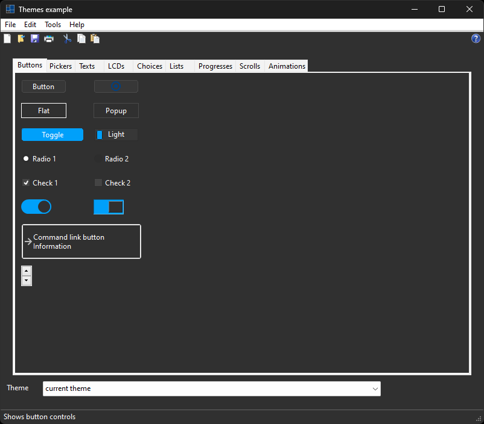

# themes

Shows how to use [xtd::forms::theme](https://gammasoft71.github.io/xtd/reference_guides/latest/classxtd_1_1forms_1_1style__sheets_1_1theme.html) class.

## Sources

* [src/themes.cpp](src/themes.cpp)
* [CMakeLists.txt](CMakeLists.txt)

## Build and run

Open "Command Prompt" or "Terminal". Navigate to the folder that contains the project and type the following:

```shell
xtdc run
```

## Output

### Windows :



### macOS :


### Gnome :


