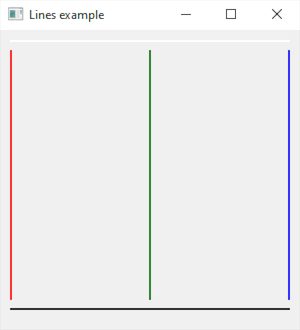
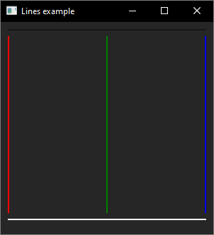
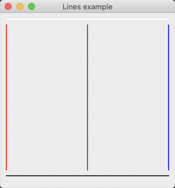
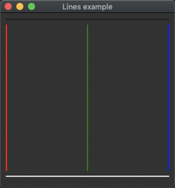
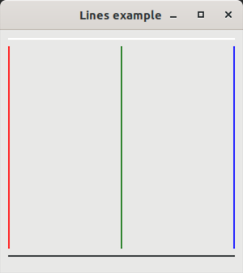
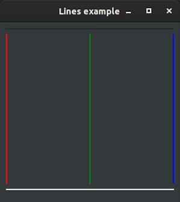

# line

demonstrates how to create a custom control with [xtd::forms::user_control](https://gammasoft71.github.io/xtd/reference_guides/latest/classxtd_1_1forms_1_1user__control.html) control.

## Sources

* [src/line.cpp](src/line.cpp)
* [CMakeLists.txt](CMakeLists.txt)

## Build and run

Open "Command Prompt" or "Terminal". Navigate to the folder that contains the project and type the following:

```shell
xtdc run
```

## Output

## Windows :





## macOS :





## Gnome :




