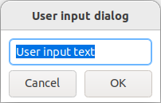
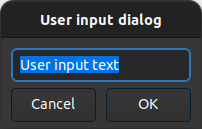

# user_dialog_show_sheet

demonstrates the use of [xtd::forms::form](https://gammasoft71.github.io/xtd/reference_guides/latest/classxtd_1_1forms_1_1form.html) as dialog.

## Sources

* [src/user_dialog_show_sheet.cpp](src/user_dialog_show_sheet.cpp)
* [CMakeLists.txt](CMakeLists.txt)

## Build and run

Open "Command Prompt" or "Terminal". Navigate to the folder that contains the project and type the following:

```shell
xtdc run
```

## Output

### Windows :


### macOS :


### Gnome :




