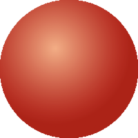

# ball

demonstrates the use of [xtd::forms::control::region](https://gammasoft71.github.io/xtd/reference_guides/latest/classxtd_1_1forms_1_1control.html#ad87086e004f60985be7fa8d6eb1f8527) property for create a circular form.

## Sources

* [properties/resources.cmake](resources/settings.cmake)
* [properties/settings.cmake](properties/settings.cmake)
* [resources/ball.icns](resources/ball.icns)
* [resources/ball.ico](resources/ball.ico)
* [resources/ball.png](resources/ball.png)
* [properties/settings.cmake](properties/settings.hpp)
* [src/ball_form.hpp](src/ball_form.hpp)
* [src/ball.cpp](src/ball.cpp)
* [src/ball.cpp](src/ball.cpp)
* [CMakeLists.txt](CMakeLists.txt)

## Build and run

Open "Command Prompt" or "Terminal". Navigate to the folder that contains the project and type the following:

```shell
xtdc run
```

## Output

### Windows :


### macOS :




### Gnome :


