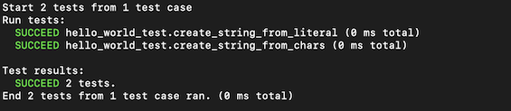

# hello_world_tunit_without_helpers

The classic first application "Hello, World!" with [xtd::tunit::console_unit_test](https://gammasoft71.github.io/xtd/reference_guides/latest/classxtd_1_1tunit_1_1console__unit__test.html) class and without helpers.

## Sources

[src/hello_world_tunit_without_helpers.cpp](src/hello_world_tunit_without_helpers.cpp)

[CMakeLists.txt](CMakeLists.txt)

## Build and run

Open "Command Prompt" or "Terminal". Navigate to the folder that contains the project and type the following:

```cmake
xtdc run
```

## Output



## Visual Studio Output


