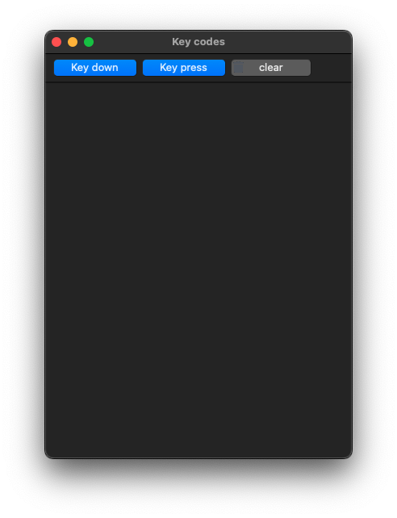
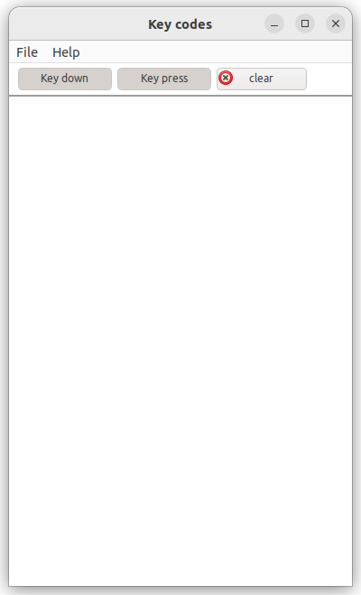
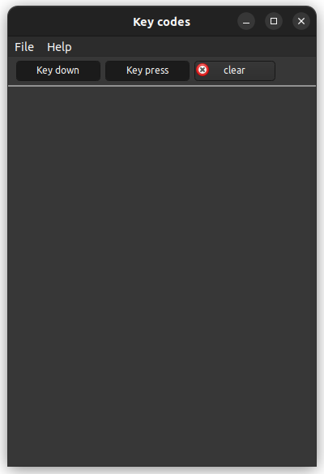

# keycoodes

Displays information about the keys entered.

## Windows :

## macOS :

## Linux Gnome :

______________________________________________________________________________________________

© 2024 Gammasoft.
