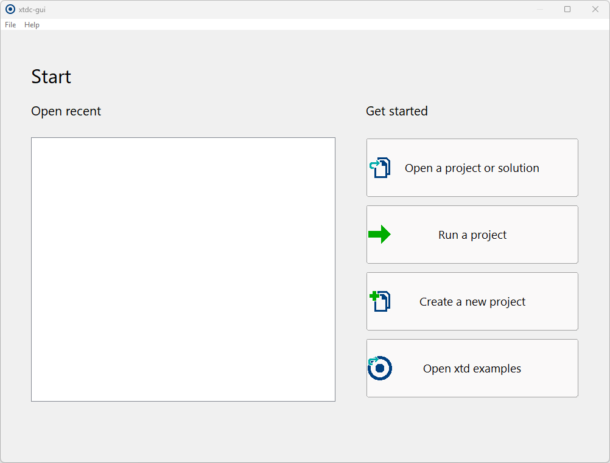
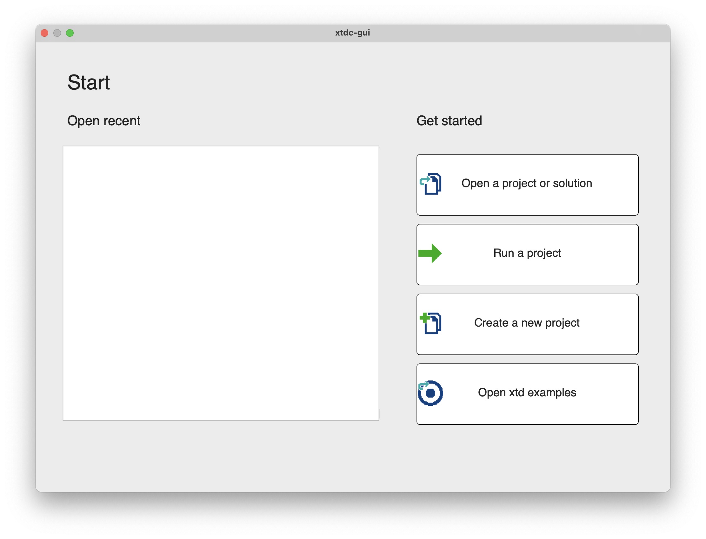
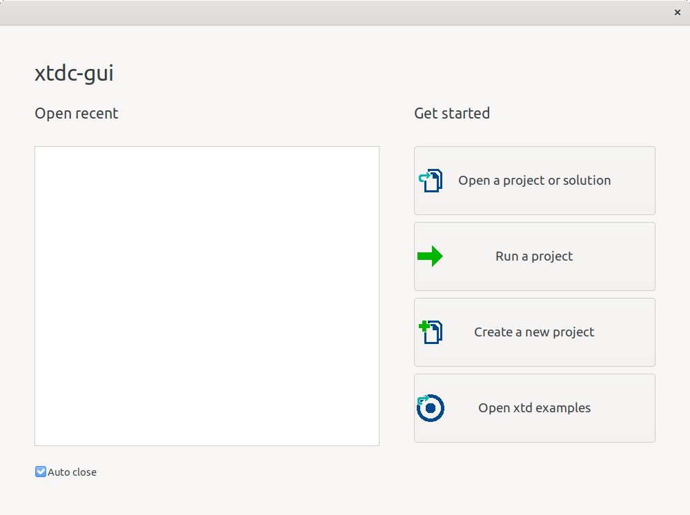

# xtdc-gui

xtdc-gui is project management GUI application.

xtdc-gui can open or run an existing project.

xtdc-gui can create and open a new project on many templates.

xtdc-gui can open an xtd example from xtd.core, xtd.forms or xtd.tunit examples.

# Templates project

xtdc-gui contians many project template. All project listed below are created with CMake and target your system (Visual Studio on Windows, Xcode on macOS and Code::Blocks or makefile on Linux).

## GUI Application sdk :

* xtd (c++)
* cocoa (objective-c)
* fltk (c++)
* Gtk+ 2 (c)
* Gtk+ 3 (c)
* Gtk+ 4 (c)
* Gtkmm (c++)
* wxWidgets (c++)
* Qt 5 (c++)
* Win32 (c)
* Winforms (c#)
* WPF (c#)

## Console Application SDK/language :

* xtd (c++)
* c++
* c
* c#
* objective-c

## Shared or static library SDK/language :

* xtd (c++)
* c++
* c
* c#
* objective-c

## Unit Test project SDK/language :

* xtd (c++)
* gtest (c++)
* catch2 (c++)

# Create and open a new project

* First step choose "Create a new project" button.
* Choose your project template then click to "Next" button
* Choose the name for your new project and the path where the project will be create, and finaly click "Create button" to create it.

## Windows :

## macOS :

## Linux Gnome :

______________________________________________________________________________________________

© 2021 Gammasoft.
